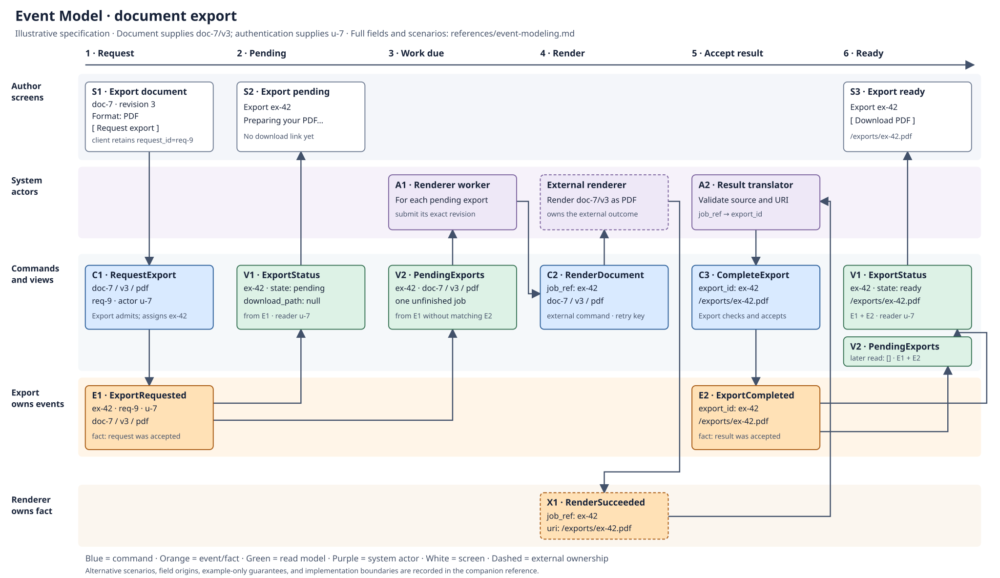

# Event Modeling

Use Adam Dymitruk's Event Modeling method for the workflow in scope. The model
describes information changing over time through concrete examples. Preserve the
method when reducing scope; model fewer workflow steps instead of replacing the
model with a summary table. The organization, review rules, and export example
below are this skill's application of the method.

## Build or revise the model

Follow the seven steps from the
[original method](https://eventmodeling.org/posts/what-is-event-modeling/):

1. **Brainstorm events.** Discover meaningful facts expressed in the past tense.
2. **Build the plot.** Arrange a plausible story on a left-to-right timeline.
3. **Storyboard.** Add screens or system interactions with concrete example data.
4. **Identify inputs.** Connect intentions to change state as commands.
5. **Identify outputs.** Connect facts to read models and their consumers.
6. **Organize ownership.** Group events into responsibility swimlanes, applying
   Conway's Law deliberately.
7. **Elaborate scenarios.** Specify each command with Given/When/Then examples
   and each read model with Given/Then examples.

Use these four patterns where the workflow needs them:

| Pattern | Information path |
| --- | --- |
| State change | Screen or actor -> command -> event |
| State view | Events -> read model -> screen or actor |
| Translation | External facts -> local interpretation |
| Automation | Pending-work view -> processor -> command -> resulting facts |

An event means something happened; a command can fail. A read model presents
known information. Reading a screen does not itself imply a domain event.
The method also applies to
[traditional systems](https://eventmodeling.org/posts/event-modeling-traditional-systems/)
where events describe changes without being stored as an event log.

## Produce a reviewable artifact

- Retain an editable visual source alongside the existing feature specification.
  Use the repository's diagramming tool if it preserves the timeline and lanes.
  SVG, a diagram-as-code source, or an editable board plus a versioned export can
  work. A board must be accessible to the maintainer; a screenshot alone is not
  the editable source. Do not require a specific commercial tool.
- Label commands, events, read models, actors, and ownership in text. Blue
  commands, orange events, and green read models help scanning, but color alone
  must not carry the meaning. Reuse approved wireframes where available; label
  schematic screens as specification examples rather than approved UI designs.
- Show one chronological example per journey. Put meaningful alternatives in
  additional timelines or attached scenarios rather than a branching algorithm
  flowchart. Use labeled lanes for human/system interactions and event ownership;
  identify external actors and boundaries explicitly.
- Include field names and representative values in cards or linked contracts.
  Account for identity, version, ordering, and units wherever they affect a rule.
  Show boundary inputs explicitly when their producer is outside the scope.
- Keep observed behavior, proposals, and unknown decisions distinguishable.
  Resolve consequential unknowns with the domain owner; do not silently invent
  permissions, retry guarantees, retention rules, or consistency guarantees.

## Review the information, then implement slices

Trace every field used by a modeled command or view to an input, earlier fact,
or declared boundary source, and follow its destinations. Look for missing data,
unowned decisions, and an external request being mistaken for confirmed success.
Do not claim completeness for portions of the system outside the stated scope.

For each changed command or view, identify its owner, scenario IDs, implementation
location, and relevant tests. Use the repository's existing names and test tools;
do not create a class, service, queue, or event store per diagram element. A read
model may be a normal query. A logical event may be a committed row change.

Specify rejection and failure examples that matter to this workflow. Consider
stale versions, duplicate requests, permissions, delayed results, partial work,
and out-of-order information where relevant. State whether anything commits and
what the user or automation can observe. A failed command need not create a
stored failure event; follow the actual contract. Review each scenario against
one command or view rather than one test for an entire journey.

Before coding, check the diagram and scenarios against the feature requirements
and existing behavior. During review, trace each changed slice through the model,
actual code, and test results. Tests should exercise observable decisions and
effects, not merely assert diagram labels or helper names. Report missing proof.
Passing rendering or syntax validation is not evidence of behavioral correctness.

For migrations, run the same agreed scenario cases against both implementations
where they coexist. Record which implementation owns each command during cutover.
When behavior changes, update the model, scenarios, contracts, and explanations
wherever affected in the same change. Retain one authoritative explanation and
link to it. Follow existing product/design approval rules.

## Worked example: export a document

This is a fictional specification, not Evoke behavior or implemented software.
It demonstrates all four patterns. The screen sketches are not a UI design.
The SVG is both the editable source and the rendered model; the contracts below
complete its abbreviated cards.

Scope: an authorized author requests a PDF of an existing immutable revision,
a worker asks an external renderer to create it, and the author receives a link.
The Document owner supplies revision `doc-7/v3`; authentication supplies `u-7`.
Both are explicit boundary inputs. The Export owner controls request admission,
job identity, status, and accepted results. The renderer owns its external result.

For this example, assume a stable request ID makes retried submissions idempotent,
the renderer honors `job_ref` as its idempotency key, and duplicate successful
callbacks with the same path do not change completed state. These are example
requirements to implement and test, not guarantees supplied by the diagram.

### Contracts and field origins

| Card | Concrete data and where it comes from |
| --- | --- |
| S1: export screen | `document_id=doc-7`, `revision=3` from Document; the author selects `format=pdf`; the client creates and retains `request_id=req-9` for this submission. |
| C1: RequestExport | S1 fields plus `actor_id=u-7` from authenticated context. Admission checks access and the exact Document revision; it assigns `export_id=ex-42` on first acceptance. |
| E1: ExportRequested | `export_id=ex-42`, `request_id=req-9`, `actor_id=u-7`, `document_id=doc-7`, `revision=3`, `format=pdf`, all from C1 and admission. |
| V1: ExportStatus | For `ex-42`, E1 produces `{state: pending, download_path: null}`; E2 later produces `{state: ready, download_path: /exports/ex-42.pdf}`. E1's actor identifies the authorized reader. |
| V2: PendingExports | Unfinished E1 jobs: `export_id`, `document_id`, `revision`, `format`; E2 removes its matching job. This view specifies pending work, not a mandated queue. |
| A1 / C2: renderer worker / RenderDocument | Worker reads V2 and sends `{job_ref: ex-42, document_id: doc-7, revision: 3, format: pdf}` to the renderer. `job_ref` comes from `export_id`; the exact immutable revision supplies document content. |
| X1: RenderSucceeded | Verified renderer result `{job_ref: ex-42, uri: /exports/ex-42.pdf}`. The renderer generates `uri` and echoes the submitted `job_ref`. Sending C2 alone does not establish X1. |
| A2 / C3: result translator / CompleteExport | Validate the result source and allowed URI, then map X1 to `{export_id: ex-42, download_path: /exports/ex-42.pdf}`. The Export owner checks that the job exists and accepts its completion. |
| E2: ExportCompleted | `export_id=ex-42`, `download_path=/exports/ex-42.pdf` from the accepted C3. It updates V1 and removes the job from V2. |
| S2 / S3: pending / ready screens | Read V1 for the returned `export_id`. S2 displays pending with no link; S3 displays ready with the returned download path. |

The request ID supports retry lookup; actor identity supports admission and read
access; the document identity/revision/format reach the renderer; job identity
correlates every result; the accepted path reaches the download screen. No field
is obtained from an unexplained global object or invented at a later step.

### Scenarios tied to slices

Each row is a separate example for the named boundary. Given facts can be set up
as ordinary database rows; they do not require replaying an event store.

| ID / slice | Given | When | Then |
| --- | --- | --- | --- |
| EX-01 / C1 | `u-7` may export `doc-7/v3`; `req-9` is unused | RequestExport with S1 values | One E1 for newly assigned `ex-42`; return that job ID. |
| EX-02 / C1 | E1 already accepted for `u-7/req-9` with identical inputs | Repeat that RequestExport | Return `ex-42`; no second job or E1. |
| EX-03 / C1 | E1 already accepted for `u-7/req-9` | Reuse `req-9` with another revision | Reject the mismatched retry; the accepted job stays unchanged. |
| EX-04 / C1 | `u-7` cannot access the document, or the requested revision is absent (separate cases) | RequestExport | Reject; no job or E1; return the specified access/missing-revision result. |
| EX-05 / V1 | E1 exists; no E2 | Read as `u-7` | Pending, null download path; no domain write. |
| EX-06 / V2 | E1 exists; no E2 | Read pending work | One entry for `ex-42` with `doc-7/v3/pdf`. |
| EX-07 / C2 | V2 contains that entry | Worker submits RenderDocument | Send exactly the C2 data; submission alone creates no E2 or ready state. |
| EX-08 / C2 | Submission outcome was lost | Worker resubmits the same `job_ref` and inputs | Under the example renderer contract, one render job; local completion still awaits a verified result. |
| EX-09 / C3 | `ex-42` is pending; verified X1 was translated | CompleteExport with the mapped values | One E2 with the accepted path. |
| EX-10 / C3 | E2 already exists with that path | Repeat identical CompleteExport | Return the existing completion; no additional E2. |
| EX-11 / C3 | E2 already exists with that path | CompleteExport with a different path | Reject the conflicting completion; retain the accepted result. |
| EX-12 / C3 | No job `ex-99` exists | CompleteExport for `ex-99` | Reject; do not create a job or completion. |
| EX-13 / V1 | E1 and E2 exist | Read as `u-7` | Ready with `/exports/ex-42.pdf`; no domain write. |
| EX-14 / V2 | E1 and matching E2 exist | Read pending work | No pending entry for `ex-42`. |
| EX-15 / V1 | E1 belongs to `u-7` | Read as unauthorized `u-8` | Deny access without exposing the job or download path. |

EX-05/06/13/14/15 are Given/Then view cases; reading is just the observation.
EX-07/08 exercise the external command adapter. Also check A2's translation
boundary with a verified X1, an untrusted source, and an invalid URI: only the
verified allowed result may reach C3. These adapter checks support the command
scenarios without treating every transport detail as a business event.

Repeated requests and rejected completions are alternate scenarios attached to
the timeline. Provider-declared failure, cancellation, timeout presentation,
expiry, and download authorization are outside this example's scope. A real
feature must resolve whichever of these its requirements need before claiming
its model complete. In particular, the model does not guarantee that a pending
job eventually completes.

### From model to implementation

Keep C1/C3 and job consistency with the Export owner; keep Document access with
the Document owner. Implement V1/V2 using the existing storage/query mechanism.
Use narrow renderer and translation adapters for C2/A2. These are responsibilities,
not required classes, files, services, or framework constructs.

During an actual implementation, record real code symbols and test names beside
the scenario IDs, then report their observed results. This illustrative package
has no application implementation or passing application-test claim. In Python,
TypeScript, or a migration between them, the same example inputs, accepted facts,
rejections, and displayed results remain the behavioral contract.
